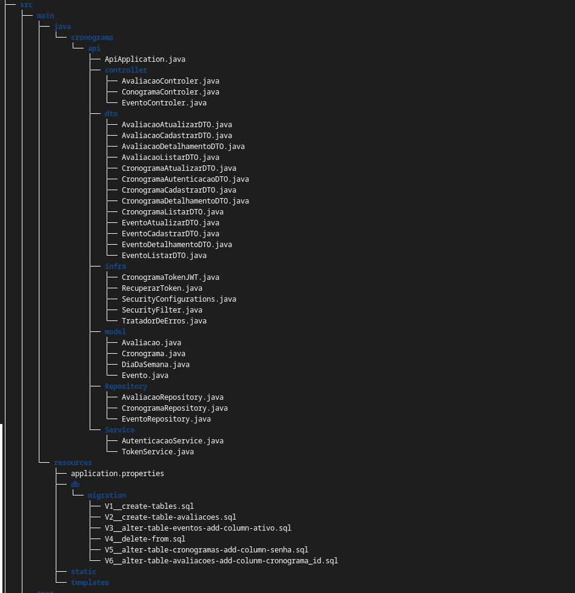

# Cronograma de Eventos API

### Descrição

A Cronograma de Eventos API é uma aplicação desenvolvida com Spring Boot que permite a criação, gerenciamento e consulta de eventos em um cronograma. A API fornece endpoints RESTful para realizar operações como cadastrar novos eventos, listar todos os eventos, atualizar informações e excluir eventos, garantindo uma interface eficiente e fácil de usar para o gerenciamento de cronogramas.


## Funcionalidades Principais

- Desenvolvimento de uma API REST
- CRUD (Create, Read, Update e Delete)
- Validações
- Paginação e ordenação 
- Query Parameters
- Exclusão lógica
- Boas práticas de API
- Tratamento de erros
- Autenticação/Autorização (USER/ADMIN)
- Tokens JWT
- Não-repúdio
- Testes automatizados


## Funcionalidades do Controller

 - **endpoints de cronogramas** com métodos POST, GET e PUT;
 - **endpoints de eventos** com métodos POST, GET, PUT e DELETE. Possui relacionamento de muitos para 1 com a entidade cronograma;
 - **endpoints de avaliações** com métodos POST, GET e PUT. Possui relacionamento de muitos para 1 com a entidade evento.
 
 O método DELETE, implementado nos endpoints de eventos, é baseado no conceito de exclusão lógica.

## Tecnologias Utilizadas

- Spring Boot 3
- Java 17
- Lombok
- MySQL/ Flyway
- JPA/Hibernate
- Maven
- Insomnia
- Security
- auth0
- junit

## Estrutura do Projeto



## Documentação da API

```http
/v3/api-docs
```
```http
/swagger-ui.html
```
